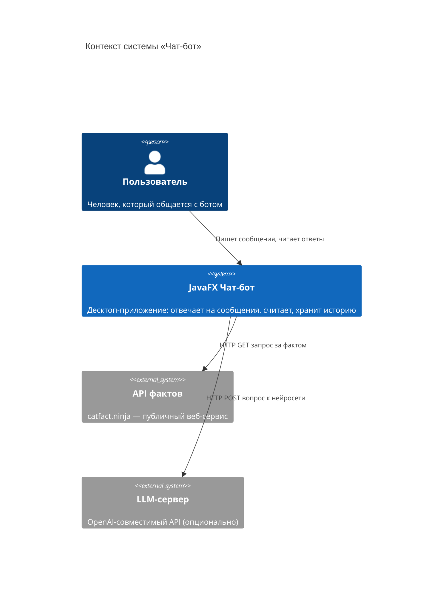
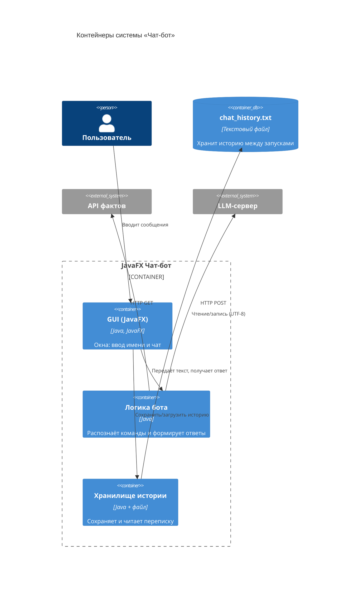
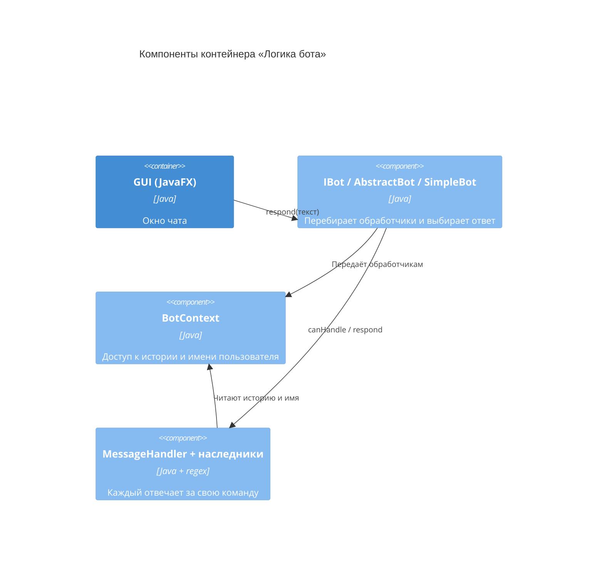

# C4 — архитектура чат-бота

**C4** — это способ описывать архитектуру программы на четырёх уровнях
детализации (отсюда «C4»). Каждый следующий уровень — как увеличение масштаба
на карте: от общего вида к деталям.

1. **Context (Контекст)** — система целиком и кто/что с ней взаимодействует.
2. **Container (Контейнеры)** — крупные части системы (приложение, файл, внешние сервисы).
3. **Component (Компоненты)** — модули внутри приложения.
4. **Code (Код)** — конкретные классы (это уже показано в [UML.md](UML.md)).

> Диаграммы написаны на Mermaid. Если C4-синтаксис не отрисовался в вашем
> просмотрщике, ниже каждого блока есть пояснение словами.

---

## Уровень 1 — Context (Контекст)

Кто пользуется системой и с какими внешними сервисами она общается.

**Словами:** пользователь общается с приложением. Приложение при необходимости
ходит в интернет за фактом (catfact.ninja) и к LLM-серверу (если задан ключ).

---

## Уровень 2 — Container (Контейнеры)

Из каких крупных частей состоит сама система.

**Словами:** внутри приложения три части — интерфейс (окна), логика бота и
хранилище. Хранилище работает с текстовым файлом, логика — с внешними API.

---

## Уровень 3 — Component (Компоненты)

Что находится внутри контейнера «Логика бота».

**Словами:** окно вызывает `IBot.respond()`. Бот по очереди спрашивает у
обработчиков, кто умеет ответить. Обработчики при необходимости берут данные из
`BotContext`.

---

## Уровень 4 — Code (Код)

Самый детальный уровень — конкретные классы и их методы — вынесен в отдельный
файл: **[UML.md](UML.md)** (диаграмма классов).

---

## Резюме архитектурных решений

- **Разделение на слои** (UI / логика / хранение) — каждый слой можно менять
  независимо.
- **Программирование на интерфейсах** (`IBot`, `HistoryStorage`) — реализации
  легко заменяются.
- **Паттерн «Стратегия» через обработчики** (`MessageHandler`) — поведение бота
  расширяется без изменения существующего кода.
