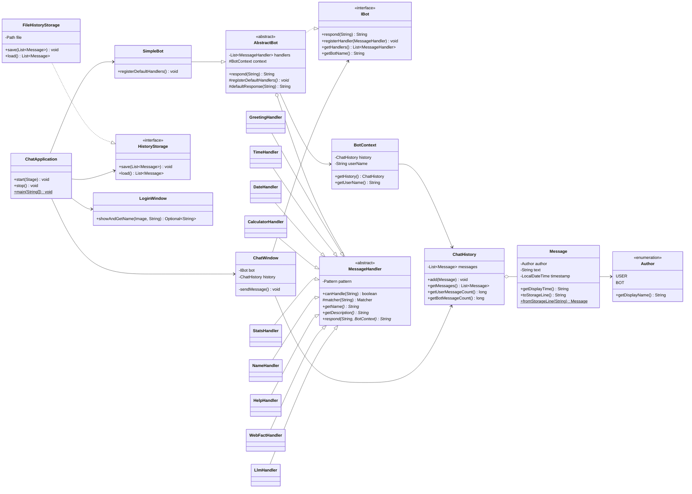

# UML — диаграмма классов чат-бота

UML (Unified Modeling Language) — стандартный язык графических схем для описания
структуры программы. Диаграмма классов показывает **из каких классов** состоит
программа и **как они связаны** между собой.

> Диаграмма ниже написана на **Mermaid**. GitHub, IntelliJ IDEA (с плагином Mermaid)
> и многие редакторы Markdown отрисуют её автоматически. Если у вас не отображается
> картинка — текст диаграммы всё равно читается как структурированное описание.

## Обозначения связей

| Стрелка | Значение | Пример в проекте |
|---------|----------|------------------|
| `..|>`  | реализует интерфейс (realization) | `SimpleBot` реализует `IBot` |
| `--|>`  | наследует класс (inheritance) | `GreetingHandler` наследует `MessageHandler` |
| `o--`   | агрегация (хранит ссылку/список) | `ChatHistory` хранит список `Message` |
| `-->`   | зависимость/использование | `ChatWindow` использует `IBot` |

## Диаграмма классов

## Как читать диаграмму

1. **Три слоя.** Модель (`Message`, `ChatHistory`, `Author`) — данные; логика бота
   (`IBot`, `AbstractBot`, `SimpleBot`, обработчики) — «ум»; интерфейс
   (`ChatApplication`, `LoginWindow`, `ChatWindow`) — окна.
2. **Бот не зависит от интерфейса.** Стрелки идут от `ChatWindow` к `IBot`, но не
   наоборот. Поэтому того же бота можно подключить к онлайн-версии.
3. **Расширяемость.** Любой новый обработчик — это ещё одна стрелка `--|>` к
   `MessageHandler`. Остальные классы при этом не меняются.
